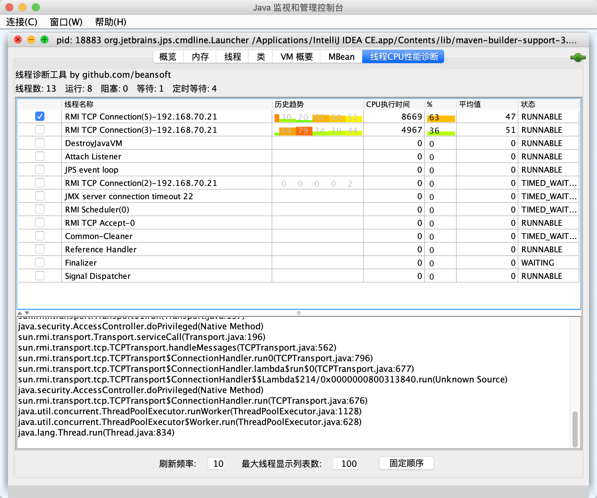

# TopThreads Chinese Version
TopThreads is a JConsole plugin that displays the most active threads of the (Java) application being monitored by JConsole.

The original article introduction: https://sharing.luminis.eu/blog/new-version-of-topthreads-jconsole-plugin/

The original latest code version at: https://bitbucket.org/pjtr/topthreads/src/master/, and I'll create a IDEA plugin version in the near future.

## Usage

To run TopThreads as JConsole plugin, pass the path to the jar file with the `-pluginpath` option:

    jconsole -pluginpath bean_topthreads.jar

TopThreads can also be run as stand alone (Swing) application, and even as console application that runs in a terminal window! The latter is very usefull if you only have telnet or ssh access to a server you want to monitor and ssh tunneling and/or enabling remote jmx monitoring is not possible.

