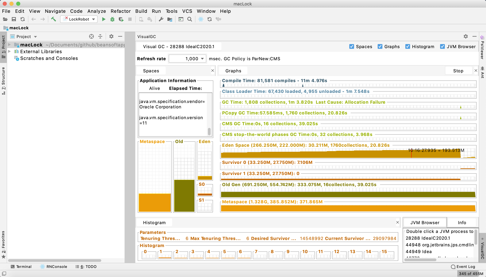

# visualgc_idea
Note: This project is only worked under IDEA, and this project should depds on the IDEA plugin SDK.

 推荐安装方式: File-> Settings-> Plugins 输入 VisualGC 即可下载.

IDEA插件仓库主页: https://plugins.jetbrains.com/plugin/14557-visualgc IDEA 2020+版本可打开页面后点击 Intall 按钮直接安装.

An IDEA plugin which displays a Visual GC tool window inside your IDE.

Usage:

1. From main interface bottom tool window;
2. From menu Tools > New VisualGC Window.

在IDEA中显示 VisualGC 子窗口, 便于一边运行代码一边观察GC情况.

用法:

1. 停靠窗口下方的 VisualGC;
2. 打开新的独立运行窗口使用菜单 Tools > New VisualGC Window.

如果需要不依赖IDEA单独运行, 请移步: [VisualGC 3.0 独立运行增强版, 支持JDK 8](https://www.cnblogs.com/beansoft/p/visualgc_jdk8_standalone.html)

安装方式:

截图:

